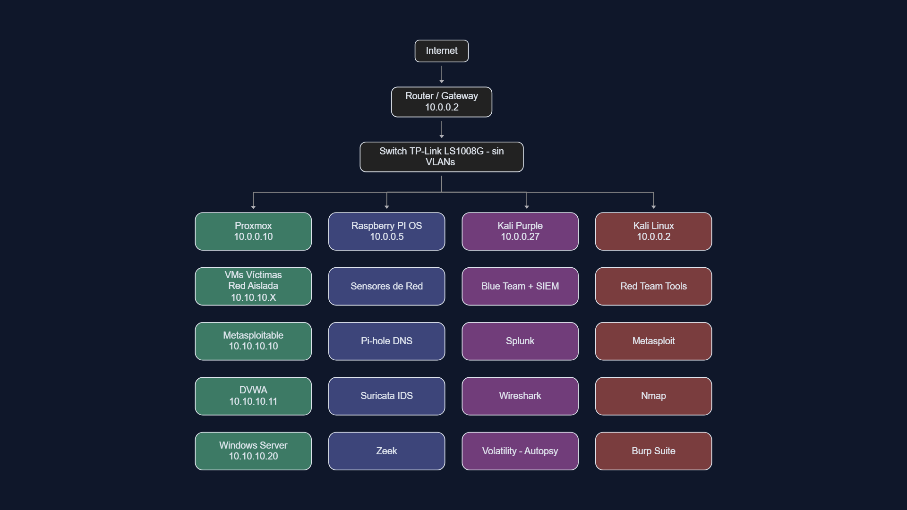
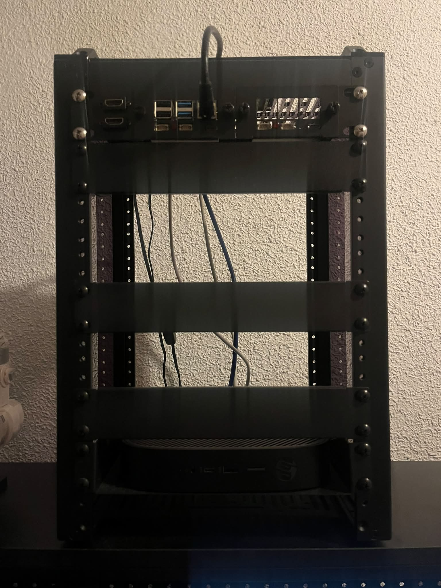
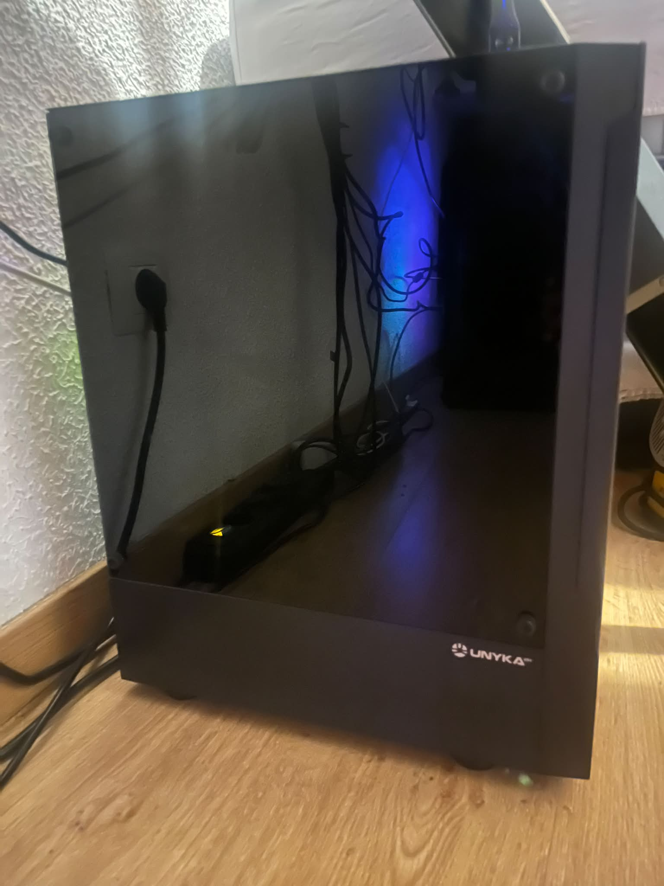
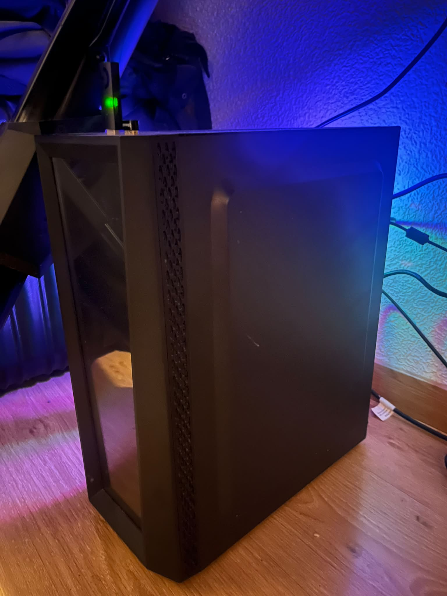

  <h1>🌌 Mi Homelab Infrastructure 🌌</h1>
  
<i>Un entorno centralizado para experimentación, despliegue de servicios y aprendizaje continuo.</i>

  
  
  
  
  

---

## 🗺️ Arquitectura de Red y Organización

La infraestructura de este homelab está diseñada para garantizar estabilidad, seguridad y un rendimiento óptimo de todos los servicios locales. A continuación se presenta el diagrama general de la topología de red, mostrando cómo se interconectan los dispositivos, el enrutamiento y la distribución de los servicios clave en la red local.

  

> **Nota:** Este diagrama ilustra el flujo de red, los nodos principales y la segmentación, facilitando una rápida comprensión de cómo están aislados o conectados los distintos servicios y dispositivos físicos.

---

## 💻 Hardware del Homelab

El entorno de computación se distribuye en tres ordenadores principales. Cada equipo cumple un rol específico dentro de la red (virtualización, almacenamiento, servicios ligeros, etc.).

 

### 🖥️ Ordenador 1: Mini PC HP T620

Su función exclusiva es repartir los recursos físicos (CPU, RAM, disco) para crear, alojar y gestionar de forma aislada todas las máquinas virtuales de la red de víctimas.

  

#### 🛠️ Especificaciones Técnicas
| Componente | Detalle |
| :--- | :--- |
| **Procesador (CPU)** | `AMD Ryzen Embedded R1305G` |
| **Memoria RAM** | `8GB DDR4` |
| **Almacenamiento** | `250 GB SSD` |
| **Rol / Sistema Operativo**| `Proxmox VE` |

 

### 🖥️ Ordenador 2: Raspberry Pi 4 B

Su función es ser la máquina anfitriona que mantiene encendidos y operativos todos los servicios críticos de infraestructura, como el filtrado de DNS y los sensores de detección de intrusos.

#### 🛠️ Especificaciones Técnicas
| Componente | Detalle |
| :--- | :--- |
| **Procesador (CPU)** | `ARM Cortex-A72` |
| **Memoria RAM** | `4GB DDR4` |
| **Almacenamiento** | `64 GB MicroSD` |
| **Rol / Sistema Operativo**| `Raspberry Pi OS Lite` |

 

### 🖥️ Ordenador 3: ASUS - Old Model

Su función es ser la máquina anfitriona que mantiene encendidos y operativos todos los servicios críticos de infraestructura, como el filtrado de DNS y los sensores de detección de intrusos.

  

#### 🛠️ Especificaciones Técnicas
| Componente | Detalle |
| :--- | :--- |
| **Procesador (CPU)** | `Intel Core i5-4570` |
| **Memoria RAM** | `16 GB DD` |
| **Almacenamiento** | `500 GB SSD` |
| **Rol / Sistema Operativo**| `Kali Purple` |

 

### 🖥️ Ordenador 4: ASUS - New Model

Funciona como la "base de operaciones" del atacante, albergando todo el arsenal ofensivo necesario para lanzar escaneos, probar exploits y comprometer a los equipos de la columna verde.

  

#### 🛠️ Especificaciones Técnicas
| Componente | Detalle |
| :--- | :--- |
| **Procesador (CPU)** | `Intel Core i5-1235U` |
| **Memoria RAM** | `32 GB DDR5` |
| **Almacenamiento** | `2 TB SSD` |
| **Rol / Sistema Operativo**| `Kali Linux` |

---

